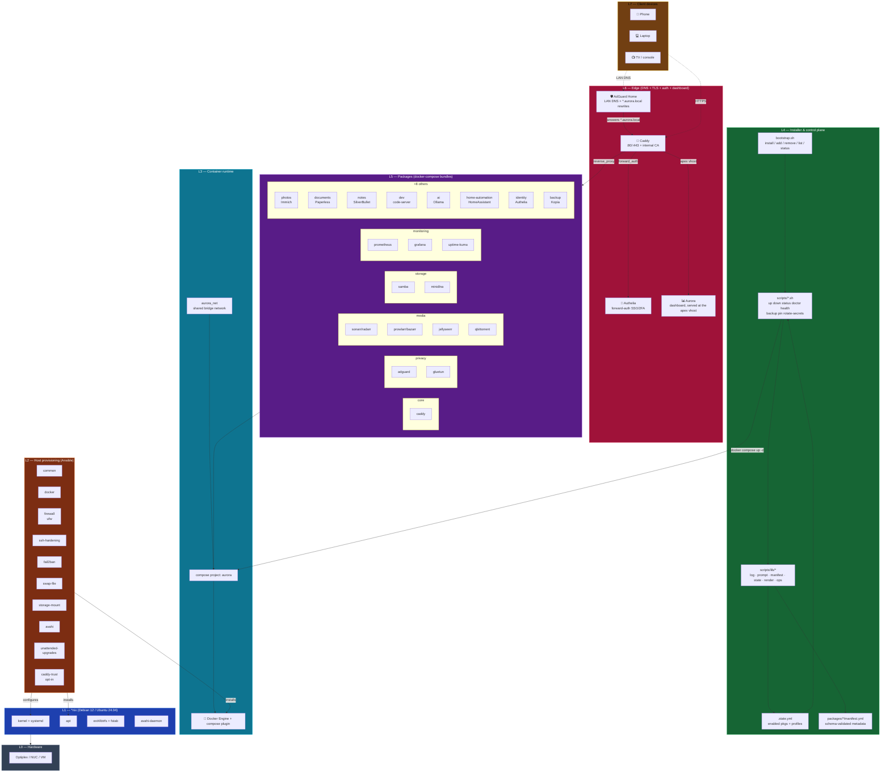
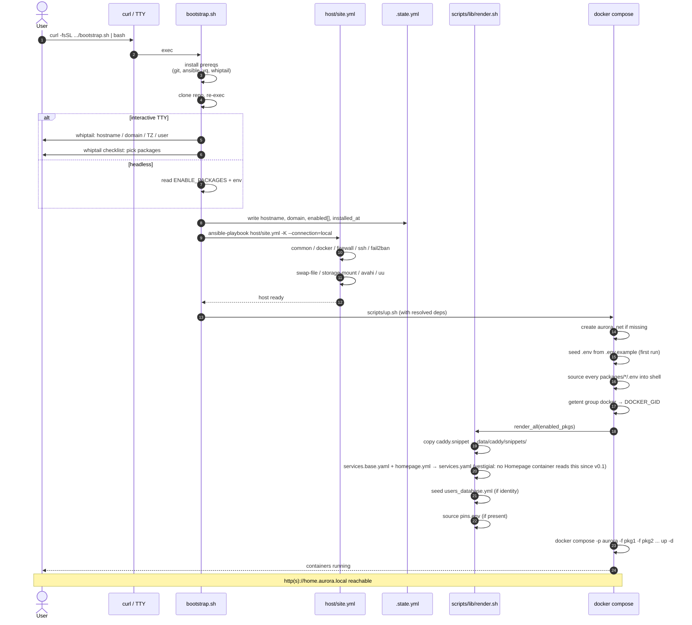
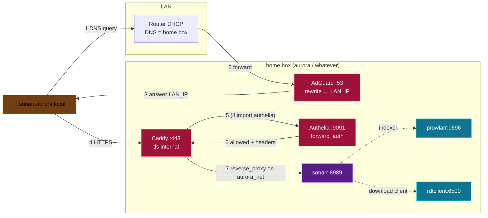

# Architecture

Three mermaid diagrams: layered stack, bootstrap sequence, request flow.

Render on GitHub by opening this file, or paste any block into
<https://mermaid.live> to iterate.

## 1. Layered view



## 2. Bootstrap sequence



## 3. Request flow (client hitting a service)



## 4. How the backend talks to a packaged service

**Standing decision: drive a packaged service through its CLI, not its
HTTP API.** Where a service ships both — Kopia, AdGuard, Authelia,
qBittorrent, Immich — the CLI is the interface Aurora uses, invoked in the
service's own container:

```
docker exec <container> <tool> <subcommand> --json
```

The dashboard backend already drives every external tool this way through
`CommandRunner`: `wg` (VpnService), `smartctl` and `snapraid`
(DisksService), `kopia` (BackupService), and `up.sh`/`down.sh`
(PackageLifecycleService, LaunchService). One seam, one place to fake in
tests (`FakeCommandRunner`), one place where timeouts, cancellation and
line streaming are already solved.

### Why not the HTTP API

- **Credentials.** A service's HTTP API needs its admin password, which
  lives in *that package's* `.env`. Reaching across package boundaries to
  read another package's secrets is a coupling worth refusing; the CLI
  inside the container is already authenticated by being there.
- **One failure vocabulary.** A CLI gives an exit code, stdout and stderr.
  Every consumer here already knows how to classify that
  (`JobFailureClassifier`), and it is the same story whether the tool is
  `wg` or `kopia`.
- **Testability.** `FakeCommandRunner` stubs a command by substring. An
  HTTP client needs a WireMock per service, and a second set of auth
  fixtures.
- **Version drift.** These projects change their HTTP APIs more freely
  than their CLI flags, and a broken CLI flag fails loudly at the exit
  code rather than silently returning a differently-shaped JSON body.

### When to break the rule

Reach for HTTP when the CLI genuinely cannot answer: streaming or
push-style data (progress events, live logs), an operation with no CLI
equivalent at all, or a service that ships no CLI. Say so in the service's
class javadoc when you do, and name what the CLI could not do — that
sentence is the point of this section.

### What this does not cover

Talking to *Docker* is `DockerService` (docker-java), not a shelled-out
`docker` CLI, because it is a long-lived API this backend depends on
structurally rather than a packaged app. Reading a file a host role wrote
(`DisksService` and the disk-state JSON) is a file read, not a CLI call.
